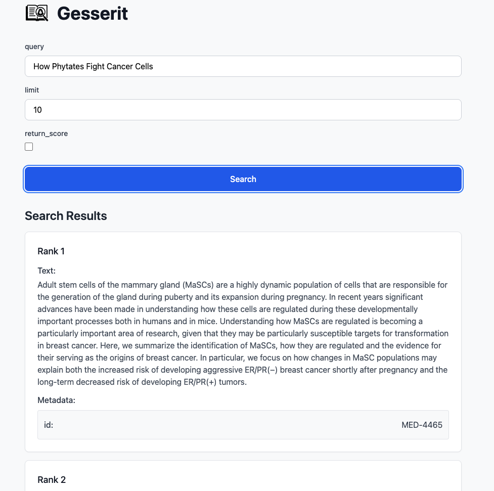
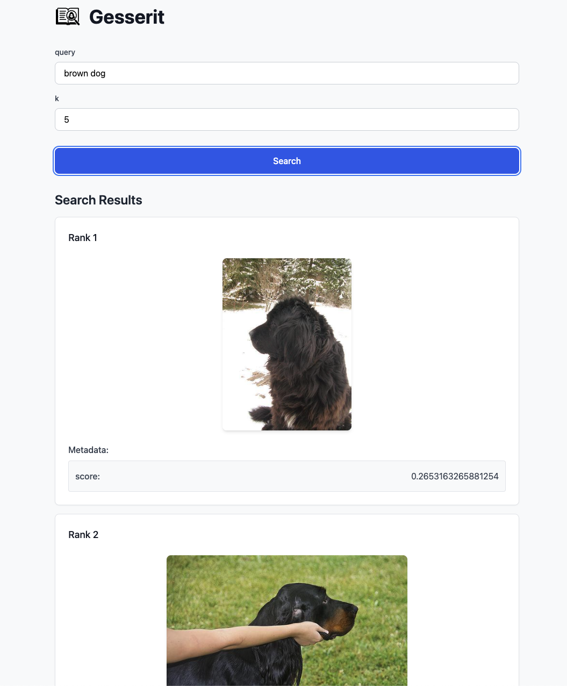

<div align="center">
  
# Gesserit

</div>

<div align="center">
  
</div>

A tiny utility to inspect retrieval results.

## Installation
Install `gesserit` from PyPI using your favorite package manager:

```bash
pip install gesserit
# or
uv add gesserit
```

## Usage

Create a search function that returns a list of `SearchItem` objects, then launch the web UI. Any typed parameters in your search function will be displayed as inputs in the UI:

```python
from gesserit import Gesserit, SearchItem

def search_function(param_1: str, param_2: int = 10, param_3: bool = False):
    # Your search implementation here
    return [
        SearchItem(text="chunk text 1", metadata={"id": "1"}), 
        SearchItem(text="chunk text 2", metadata={"id": "2"})
    ]

app = Gesserit(search_function=search_function)
app.run()  # Accepts any uvicorn parameters
```

## BEIR example
Run `uv run examples/beir_nfcorpus.py` to see a simple example using `gesserit` to inspect retrieval results. This example demonstrates text search on the NFCorpus dataset using LanceDB full-text search.  
UI looks like this:



## Image Search Example
Run `uv run examples/clip.py` to see a simple example using `gesserit` to inspect image search results. This example demonstrates image search on the Mini-ImageNet dataset using CLIP.
UI looks like this:

